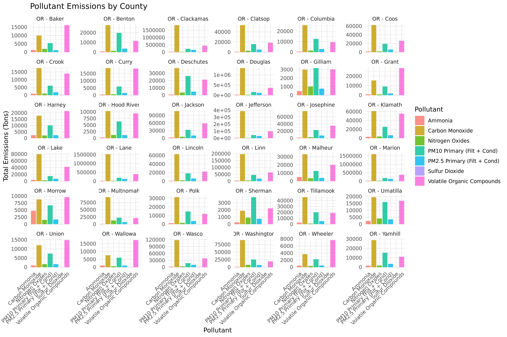
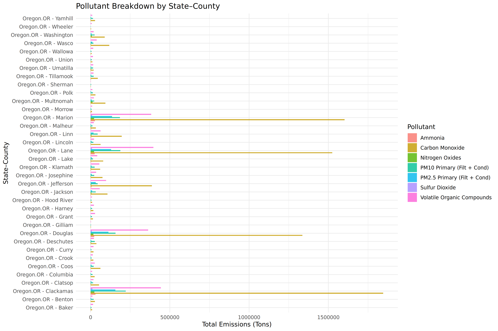

# MEDIUM_TEST 

# USED_PACKAGES:
1) "tidyr" (version: ‘1.3.2’)
2) "glmmTMB" (version: ‘1.1.14’)
3) "lme4" (version: ‘1.1.38’)
4) "ggplot2" (version: ‘4.0.1’)
5) "readr" (version: ‘2.1.6’)
6) "dplyr" (version: ‘1.1.4’)
7) "knitr" (version: ‘1.51’)
8) "rlang" (version: ‘1.1.7’)

# DATASET_NAME: 
[air.csv](air.csv)

# Summary DataSet_air_csv:
- This dataset records air pollutant emissions across Oregon counties, broken down by pollutant type and emission source.
- It includes both diesel and non‑diesel vehicle categories, with detailed source classifications (SCC codes and sector descriptions).
- Each row represents a state–county–pollutant combination, reporting emissions in tons along with sector and source details.
- "Overall, the data provides a structured view of regional air quality indicators, highlighting how different sources contribute to pollution".

# Function_Applied: 

1)  ***function_1 (Name:- filter_data)***:
       Application of the is to output a clean filter data ,with appropriate accountable names and ensuring no null data input.
       [Filtered_Data](result/clean_data.html)

2)  ***function_2 (Name:- eda)***:
        ***(EDA: Exploratory Data Analysis)***
    1)    [Overall Statistics of Data](result/overall_stats.html)
    2)    [Pollutant Statistics](result/pollutant_stats.html)
    3)    [States Statistics](result/state_stats.html)

3)  ***function_3 (Name:- Visualization)***:
    1) Plot1: ("Pollutant Emissions by County (Faceted Bar Plot)")
    - Each bar represents the total emissions of a pollutant within a single county.
    - The y‑axis shows the magnitude of emissions (in tons).
    - By faceting, you can see each county’s pollutant profile separately.
    - Taller bars indicate pollutants that contribute more heavily in that county.
    - "The plot reveals which pollutants dominate in which counties, highlighting local emission patterns."

    

    2) Plot2: ("Pollutant Breakdown by State–County (Grouped Bar Plot)")
    - Each cluster of bars corresponds to a state–county combination.
    - Within each cluster, bars show the relative emissions of different pollutants.
    - The y‑axis measures total emissions, allowing direct comparison across pollutants.
    - Side‑by‑side bars let you see differences in pollutant composition within the same region.
    - "The plot highlights regional contrasts, showing how pollutant mixes vary across states and counties."

    

4) ***function_4 (Name:- model_data)***:
    [Data](result/modeling_data.html)
    **Note:** 
        model_data() prepares the dataset for modeling by cleaning and transforming emissions data. It filters pollutants with sufficient observations, removes extreme outliers, and creates meaningful categorical variables (e.g., source type, region).

5) ***function_5 (Name:- fit_models)***:
    - WE ARE USING TWO TYPE OF STATISTICAL MODEL:
    1) Linear Mixed‑Effects Models (lme4::lmer)
    2) Generalized Linear Mixed Models(glmmTMB::glmmTMB)
    
    - MODEL_1:  
        "IT ANSWER THE QUESTION OF, Which pollutants have systematically higher emissions across counties?"
         1) [lme4_q1](result/lme4_q1_summary.html)

         2) [glmmTMB_q1](result/glmmTMB_q1_summary.html)

    - MODEL_2:
        "IT ANSWER THE QUESTION OF,How much variation in emissions is due to county vs pollutant type?"
        1) [lme4_q3](result/lme4_q3_summary.html)

        2) [glmmTMB_q3](result/glmmTMB_q3_summary.html)

    - MODEL_3:
        "IT ANSWER THE QUESTION OF,Are diesel sources consistently higher emitters than non‑diesel sources?"
        1)  [lme4_q4](result/lme4_q4_summary.html)
        
        2)  [glmmTMB_q4](result/glmmTMB_q4_summary.html)

6) ***function_6 (Name:- compare_models)***:
    - Comparsion different model results quality,  used to answer the question's up there.
    - Comparsion is done on statistical fit criteria.
    - Parameters used for comparsion are :
        1) AIC (Akaike Information Criterion)
        2) BIC (Bayesian Information Criterion)
        3) LogLik (Log‑Likelihood)
    - AIC and BIC balance goodness‑of‑fit against model complexity, penalizing over‑parameterization.
    - Log‑Likelihood measures how well the model explains the observed data.
      
    |Model      |      AIC|      BIC|    LogLik|
    |:----------|--------:|--------:|---------:|
    |lme4_q1    | 62999.78| 63075.06| -31490.89|
    |glmmTMB_q1 | 62951.86| 63027.13| -31466.93|
    |lme4_q3    | 62999.78| 63075.06| -31490.89|
    |glmmTMB_q3 | 62951.86| 63027.13| -31466.93|
    |lme4_q4    | 62930.07| 63013.70| -31455.03|
    |glmmTMB_q4 | 62874.73| 62958.37| -31427.37|

    - [Comparsion_](result/model_comparsion.html)
